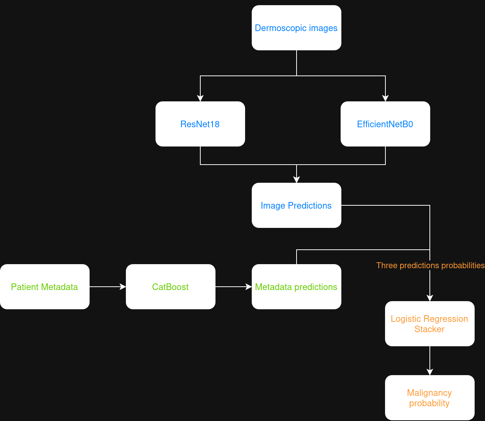
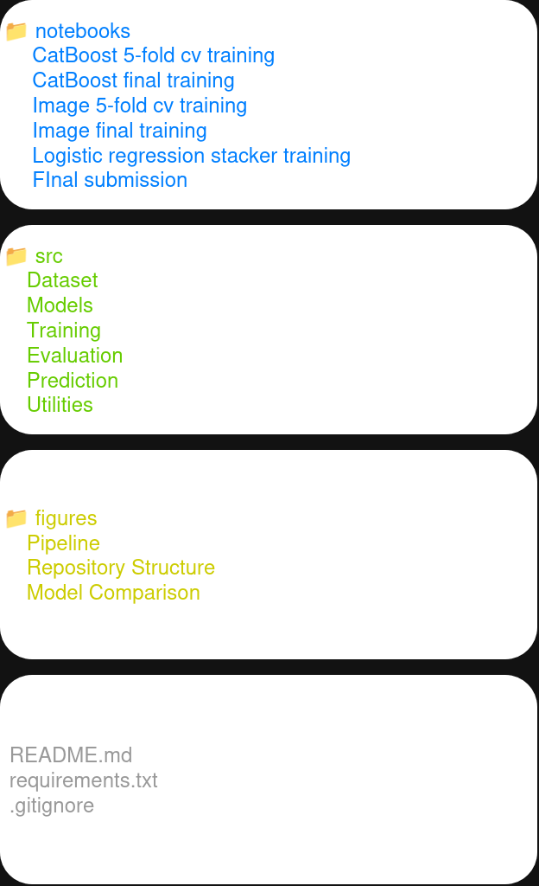
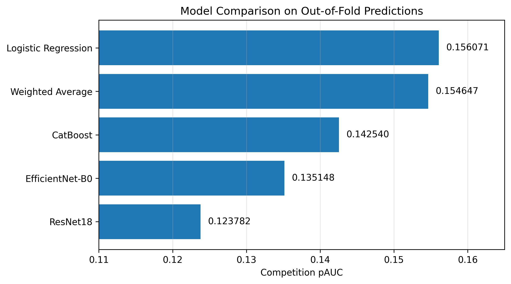

# ISIC 2024 – Multimodal Skin Cancer Detection

A multimodal machine learning pipeline developed for the **ISIC 2024 – Skin Cancer Detection with 3D-TBP** Kaggle competition. The project combines image-based deep learning models and patient metadata through a stacking ensemble to improve melanoma detection performance.

The proposed solution integrates two convolutional neural networks (**ResNet18** and **EfficientNet-B0**) with a **CatBoost** classifier trained on tabular metadata. Their predictions are combined using a **Logistic Regression** meta-model, producing a unified malignancy probability for each lesion.

The repository contains the complete training and inference pipeline, including cross-validation, final model training, multimodal stacking, and submission generation, providing a fully reproducible workflow from raw competition data to the final Kaggle submission.

## Project Highlights

* **Multimodal classification pipeline** combining dermoscopic images and patient metadata.
* **Dual image models** based on **ResNet18** and **EfficientNet-B0**.
* **CatBoost metadata classifier** trained on the complete ISIC 2024 metadata.
* **Logistic Regression stacking** to combine image and metadata predictions into a single malignancy score.
* **Five-fold Stratified Group Cross-Validation** for robust model evaluation and unbiased Out-of-Fold predictions.
* **Official ISIC 2024 evaluation metric (competition pAUC)** used throughout training and validation.
* **Fully reproducible workflow**, including model training, stacking, and submission generation.

## Pipeline Overview

The proposed solution follows a multimodal machine learning pipeline that combines predictions from metadata-based and image-based models through a stacking ensemble.

The workflow begins by training three independent base models:

* **CatBoost** on patient metadata and lesion attributes.
* **ResNet18** on dermoscopic images.
* **EfficientNet-B0** on dermoscopic images.

Each model is first evaluated using five-fold Stratified Group Cross-Validation to generate unbiased Out-of-Fold predictions. After validating the training strategy, the selected models are retrained on the complete training dataset.

Finally, the predictions produced by the three base models are standardized and combined using a **Logistic Regression** meta-model, generating the final malignancy probability used for submission.

The complete workflow is illustrated below.

<p align="center">
  
</p>

## Repository Structure

The repository is organized as a sequence of independent notebooks, each responsible for a specific stage of the machine learning pipeline. This modular design improves readability, simplifies experimentation, and allows every step—from model development to final inference—to be reproduced independently.

The overall repository organization is illustrated below.

<p align="center">
  
</p>

The main notebooks are organized as follows:

| Notebook                                     | Description                                                                                                                                         |
| -------------------------------------------- | --------------------------------------------------------------------------------------------------------------------------------------------------- |
| **01_catboost_5fold_cv.ipynb**               | Trains and evaluates the metadata model using Stratified Group Cross-Validation and generates Out-of-Fold predictions.                              |
| **02_catboost_final_training.ipynb**         | Retrains the CatBoost model on the complete metadata dataset for final inference.                                                                   |
| **03_image_5fold_cv.ipynb**                  | Trains and evaluates the ResNet18 and EfficientNet-B0 image classifiers using five-fold cross-validation.                                           |
| **04_image_final_training.ipynb**            | Retrains the selected image architectures on the complete training dataset.                                                                         |
| **05_logistic_regression_stacking.ipynb**    | Trains the meta-model using Out-of-Fold predictions from the three base models and compares the stacking strategy with simpler ensemble approaches. |
| **06_final_submission.ipynb**                | Loads the pretrained models, performs inference on the competition test set, and generates the final Kaggle submission file.                        |

## Methodology

The proposed solution is composed of three complementary components: a metadata classifier, image-based deep learning models, and a stacking ensemble that combines their predictions. The following subsections describe each component and its role within the final multimodal pipeline.

### Metadata Model

Patient metadata and lesion descriptors are modeled using **CatBoost**, a gradient boosting algorithm particularly well suited for heterogeneous tabular datasets containing both numerical and categorical variables.

The metadata preprocessing pipeline includes feature engineering, categorical feature handling, and the generation of Out-of-Fold predictions through five-fold Stratified Group Cross-Validation. After validating the selected hyperparameters, a final CatBoost model is retrained using the complete metadata dataset and later used during inference.

### Image Models

Dermoscopic images are modeled using two complementary convolutional neural network architectures: **ResNet18** and **EfficientNet-B0**. Both models are initialized with ImageNet pretrained weights and fine-tuned on the ISIC 2024 training dataset.

Model development follows a two-stage training strategy. First, each architecture is evaluated using five-fold Stratified Group Cross-Validation to generate unbiased Out-of-Fold predictions and estimate its generalization performance. Once the training configuration is validated, the selected architectures are retrained on the complete dataset to produce the final models used during inference.

The resulting image classifiers capture visual characteristics of skin lesions that complement the information available in the patient metadata.

### Stacking Ensemble

The final prediction is obtained by combining the outputs of the three base models through a **Logistic Regression** stacking ensemble.

Out-of-Fold predictions generated during cross-validation are used as training data for the meta-model, ensuring that the stacking model is trained exclusively on predictions produced from unseen samples. This prevents information leakage while allowing the Logistic Regression classifier to learn the optimal contribution of each base model.

During inference, prediction probabilities from the final CatBoost, ResNet18, and EfficientNet-B0 models are passed to the trained Logistic Regression model, which produces the final malignancy probability submitted to the competition.

This multimodal strategy consistently outperformed each individual model as well as a simple weighted-average ensemble, demonstrating the benefit of learning an optimal combination of metadata-based and image-based predictions.

## Results

Model performance was evaluated using the official **ISIC 2024 competition metric (competition pAUC)** computed from Out-of-Fold predictions generated during five-fold Stratified Group Cross-Validation.

The comparison below summarizes the performance of the individual models, a simple weighted-average ensemble, and the proposed Logistic Regression stacking approach.

<p align="center">
  
</p>

| Model                          |      ROC-AUC | Competition pAUC |
| :----------------------------- | -----------: | ---------------: |
| Logistic Regression (Stacking) | **0.942497** |     **0.156071** |
| Weighted Average               |     0.940503 |         0.154647 |
| CatBoost                       |     0.926005 |         0.142540 |
| EfficientNet-B0                |     0.914196 |         0.135148 |
| ResNet18                       |     0.894274 |         0.123782 |

The multimodal Logistic Regression stacker achieved the best overall performance, outperforming both the individual models and the weighted-average ensemble. These results demonstrate that image-based and metadata-based classifiers provide complementary information and that learning an optimal combination of their predictions leads to a measurable improvement over simpler ensemble strategies.

### Kaggle Leaderboard

The final submission achieved the following scores on the ISIC 2024 Kaggle leaderboard:

| Leaderboard | Competition pAUC |
|-------------|-----------------:|
| Public | 0.16808 |
| Private | 0.15407 |

## Installation

Clone the repository:

```bash
git clone https://github.com/<your-username>/ISIC2024-Skin-Cancer-Detection.git
cd ISIC2024-Skin-Cancer-Detection
```

Create a Python environment and install the required dependencies:

```bash
python -m venv .venv
source .venv/bin/activate      # Linux / macOS

pip install -r requirements.txt
```

The project was developed using **Python 3.12**, **PyTorch**, **CatBoost**, and **scikit-learn**.

## Usage

The notebooks are designed to be executed independently and document each stage of the machine learning pipeline.

Before running a notebook, update the dataset, model, and output paths defined in the **Configuration** section to match your local environment or Kaggle workspace. Once the paths are configured, each notebook can be executed sequentially to reproduce the corresponding stage of the project.

The project was primarily developed and evaluated in the Kaggle Notebook environment. Running the notebooks locally may require adjusting file paths and installing the listed dependencies.

## Future Work

Several improvements could be explored to further enhance the proposed multimodal pipeline:

* **Evaluate additional image architectures**, such as ConvNeXt, Vision Transformers (ViT), or more recent EfficientNet variants.
* **Investigate additional metadata models**, including XGBoost and LightGBM, to increase model diversity within the ensemble.
* **Train multiple models with different random seeds** and average their predictions to improve robustness and reduce prediction variance.
* **Explore more expressive stacking models**, such as gradient boosting methods or shallow neural networks, while carefully controlling overfitting.
* **Perform systematic hyperparameter optimization** for both the image models and the stacking strategy using automated search techniques.

Although these directions were beyond the scope of the current project, they represent promising opportunities for improving predictive performance and further exploring multimodal learning for skin lesion classification.

## Acknowledgments

This project was developed using the dataset and evaluation protocol provided by the **ISIC 2024 – Skin Cancer Detection with 3D-TBP** challenge, hosted on **Kaggle**.

The challenge organizers and the International Skin Imaging Collaboration (ISIC) are gratefully acknowledged for making the dataset and competition resources publicly available, enabling research and experimentation in automated skin lesion classification assist.

## License

This project is released under the **MIT License**. See the `LICENSE` file for additional information.

This project is released for educational and research purposes.
